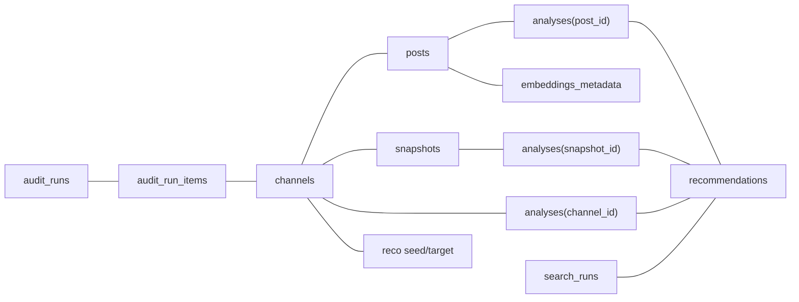

# Telegram Channel Intelligence Dashboard

Платформа для поиска, сбора, анализа и интеллектуальной обработки данных Telegram-каналов (AI-пайплайн, semantic search, витрина данных).

**Стек:** FastAPI, SQLite + SQLAlchemy (async), Telethon, OpenAI, Qdrant; фронтенд — Next.js 15 в `apps/web`.

---


## Оглавление


| Раздел                                                      | О чём                                                                                       |
| ----------------------------------------------------------- | ------------------------------------------------------------------------------------------- |
| [Запуск с Docker Compose](#toc-docker-compose)              | Основной способ поднять API, Qdrant и Web                                                   |
| [Переменные окружения](#toc-environment)                    | Полный перечень `.env` и где задать                                                         |
| [Примеры curl](#toc-curl-examples)                          | `POST /channels`, `POST /ai/plan_and_collect`, `POST /channels/{id}/collect` + примеры JSON |
| [База данных и аудит](#toc-database)                        | Путь к SQLite, таблицы, как посмотреть                                                      |
| [Набор из 10 тестовых запросов](#toc-ten-queries)           | Таблица: query → `expected_needs_review` → обоснование → критерий успеха                    |
| [Проверка контракта (ручная и pytest)](#toc-contract-check) | Какой тест гонять, скрипты                                                                  |
| [Документация проекта (MD)](#toc-project-docs)              | Ссылки на все актуальные `.md`                                                              |
| [Схема данных SQLite](#toc-sqlite-schema)                   | ORM, миграции, mermaid                                                                      |
| [Тесты backend](#toc-backend-tests)                         | Краткий обзор                                                                               |


---

## Требования


| Компонент               | Версия / примечание                |
| ----------------------- | ---------------------------------- |
| Python                  | 3.10+ (в Docker-образе API — 3.12) |
| Node.js                 | 20+                                |
| Docker и Docker Compose | Для рекомендуемого полного стека   |


---


## Запуск с Docker Compose

**Подготовительный этап**
Для запуска с приложения вам понадобится:

- Интернет доступ
- Ссылка на репозиторий с проектом
- Установленный Docker и Docker Compose
- Смартфон с Телеграм
- OPENAI_API_KEY (см. [платформу OpenAI](https://platform.openai.com/api-keys)) и положительный баланс на платформе
- TELEGRAM_API_ID и TELEGRAM_API_HASH

**Как получить `TELEGRAM_API_ID` и `TELEGRAM_API_HASH`**

1. Откройте **[my.telegram.org](https://my.telegram.org)** и войдите под своим **номером телефона**, привязанным к Telegram (придёт код в приложение Telegram).
2. Перейдите в раздел **«API development tools»** (или «Developing apps»).
3. Если приложение ещё не создано, заполните короткую форму (название приложения и т.п.) и подтвердите.
4. На странице вы увидите:
  - `**api_id`** — целое число → подставьте в `**TELEGRAM_API_ID**` в `.env`;
  - `**api_hash**` — строка из букв и цифр → в `**TELEGRAM_API_HASH**`.
5. Храните пару **api_id / api_hash** как секрет: их нельзя публиковать в репозитории и светить в скриншотах.
6. **Клонирование и `.env`**

```bash
git clone <url-репозитория>
cd tg-channel-intelli-dashboard
cp .env.example .env
# В .env заполните как минимум OPENAI_API_KEY, TELEGRAM_API_ID, TELEGRAM_API_HASH и при необходимости сессию — см. таблицу ниже.
```

1. **Старт**

Из **корня** репозитория (рядом с `docker-compose.yml` и `.env`):

```bash
docker compose up --build -d
```

1. **Сервисы**


| Сервис   | Назначение          | Порт (хост)              |
| -------- | ------------------- | ------------------------ |
| `qdrant` | Векторное хранилище | 6333 (HTTP), 6334 (gRPC) |
| `api`    | FastAPI             | 8000                     |
| `web`    | Next.js             | 3000                     |


- Фронтенд: [http://localhost:3000](http://localhost:3000)  
- Swagger / OpenAPI: [http://localhost:8000/docs](http://localhost:8000/docs)  
- Health: [http://localhost:8000/api/v1/health](http://localhost:8000/api/v1/health)

Приложение: **[http://localhost:3000](http://localhost:3000)**

Перед стартом API entrypoint выполняет `**alembic upgrade head`**. Каталог `**./backend/data**` монтируется в контейнер (SQLite, сессии Telethon и т.д.).

В момент первого обращения к Telegram при работе с приложением запустится авторизация (получение сессии) в рамках которой нужно будет ввести номер телефона, с которым Вы получали TELEGRAM_API_ID и TELEGRAM_API_HASH (придёт код в приложение Telegram).

**Telegram:** для живого поиска и сбора нужна авторизованная user-сессия. Варианты: HTTP-вход (`TELEGRAM_INTERACTIVE_LOGIN=true`, см. [TELEGRAM_TELETHON.md](backend/docs/TELEGRAM_TELETHON.md)) или заранее выданный `**TELEGRAM_SESSION`** / файл `**{TELEGRAM_SESSION_NAME}.session**` в каталоге `**TELEGRAM_SESSION_DIR**` (по умолчанию относительно рабочей директории backend: `data/sessions`).

### Локально без полного Compose

- **Только backend:** [backend/README.md](backend/README.md)  
- **Только Next.js:** `cd apps/web && npm install && npm run dev` (нужен `NEXT_PUBLIC_API_BASE_URL` в `.env`)  
- **Только Qdrant:** `docker compose up qdrant` и в `.env` у backend: `QDRANT_URL=http://localhost:6333`

---


## Переменные окружения

Канонический образец — в корневом `**.env.example`**. Ниже — сводка (имена переменных как в файле). Детали Telethon — [backend/docs/TELEGRAM_TELETHON.md](backend/docs/TELEGRAM_TELETHON.md); Qdrant — [backend/docs/QDRANT_SEMANTIC_LAYER.md](backend/docs/QDRANT_SEMANTIC_LAYER.md).


| Переменная                                                         | Обязательность                 | Назначение                                                                                                           |
| ------------------------------------------------------------------ | ------------------------------ | -------------------------------------------------------------------------------------------------------------------- |
| `ENVIRONMENT`                                                      | опционально                    | `development` / `staging` / `production`                                                                             |
| `LOG_LEVEL`                                                        | опционально                    | Уровень логов backend                                                                                                |
| `BACKEND_HOST`, `BACKEND_PORT`                                     | опционально                    | Bind uvicorn в контейнере                                                                                            |
| `BACKEND_CORS_ORIGINS`                                             | опционально                    | Список origin через запятую                                                                                          |
| `**DATABASE_URL**`                                                 | рекомендуется                  | SQLite по умолчанию: `sqlite+aiosqlite:///./data/app.db` (путь относительно **рабочей директории процесса backend**) |
| `**OPENAI_API_KEY`**                                               | для LLM/эмбеддингов            | Ключ OpenAI                                                                                                          |
| `OPENAI_EMBEDDING_MODEL`, `OPENAI_CHAT_MODEL`                      | опционально                    | Модели по умолчанию в `.env.example`                                                                                 |
| `OPENAI_EMBEDDING_DIMENSIONS`                                      | опционально                    | Ожидаемая размерность вектора (в коде по умолчанию 1536; `0` — не проверять)                                         |
| `EMBEDDING_MAX_CHUNK_CHARS`                                        | опционально                    | Лимит символов на чанк перед эмбеддингом                                                                             |
| `**TELEGRAM_API_ID**`, `**TELEGRAM_API_HASH**`                     | для Telethon                   | С [my.telegram.org](https://my.telegram.org) → API development tools                                                 |
| `TELEGRAM_SESSION`                                                 | при отсутствии `.session`      | StringSession (приоритет над файлом)                                                                                 |
| `TELEGRAM_SESSION_NAME`, `TELEGRAM_SESSION_DIR`                    | опционально                    | Файловая сессия: имя и каталог (`data/sessions`)                                                                     |
| `TELEGRAM_FLOOD_MAX_WAIT_SECONDS`, `TELEGRAM_FLOOD_RETRY_ATTEMPTS` | опционально                    | Ограничение ожиданий при FloodWait                                                                                   |
| `TELEGRAM_INTERACTIVE_LOGIN`                                       | опционально                    | `true` — эндпоинты `/api/v1/telegram/auth/*`                                                                         |
| `**QDRANT_URL**`                                                   | для semantic / похожих каналов | Напр. `http://localhost:6333` или `http://qdrant:6333` в compose                                                     |
| `QDRANT_API_KEY`, `QDRANT_COLLECTION_NAME`                         | опционально                    | Облако Qdrant / имя коллекции по умолчанию для `VectorService`                                                       |
| `NEXT_PUBLIC_API_BASE_URL`                                         | для web                        | URL API в браузере                                                                                                   |
| `API_URL`                                                          | для SSR web в Docker           | Напр. `http://api:8000`                                                                                              |


Backend читает `.env` из **текущей директории** и родителя (см. `backend/app/core/config.py`) — удобно держать один `.env` в **корне** репозитория.

---


## Примеры curl

Ниже `**BASE=http://localhost:8000`**. Для читаемого вывода добавьте `**| jq**`, если установлен [jq](https://jqlang.github.io/jq/).

Фактические поля ответов зависят от данных в БД и от ответов OpenAI; структура соответствует схемам FastAPI.

### 1. `POST /api/v1/channels` — создать канал в каталоге

```bash
export BASE=http://localhost:8000

curl -sS -X POST "$BASE/api/v1/channels" \
  -H "Content-Type: application/json" \
  -d '{
    "channel_ref": "durov",
    "title": "Пример канала",
    "topic_search": "технологии"
  }'
```

**Ожидаемая форма ответа** (`ChannelCreateResult`):

```json
{
  "id": 1,
  "username": "durov",
  "sync_status": null,
  "already_exists": false,
  "message": "…"
}
```

Подставьте `**id**` из ответа в следующий запрос.

### 2. `POST /api/v1/ai/plan_and_collect` — план без фактического сбора

Требуется рабочий `**OPENAI_API_KEY**`.

```bash
curl -sS -X POST "$BASE/api/v1/ai/plan_and_collect" \
  -H "Content-Type: application/json" \
  -d '{
    "query": "Найди русскоязычные Telegram-каналы про нейросети за последние две недели"
  }'
```

**Ожидаемая форма ответа** (`AIPlanAndCollectResponse`):

```json
{
  "plan_steps": [
    "Сформулировать параметры поиска по теме «нейросети»",
    "Вызвать POST /api/v1/search-channels с фильтрами языка и периода"
  ],
  "api_url": "/api/v1/search-channels",
  "fields_to_keep": [
    "id",
    "telegram_id",
    "username",
    "title",
    "description",
    "subscriber_count",
    "primary_topic",
    "last_post_at",
    "language_hint",
    "region_country"
  ],
  "confidence": "high",
  "needs_review": false
}
```

При `**needs_review": true**` (запрос слишком общий или `confidence`: `low`) автоматический «collect» из этого шага не выполняется — зафиксируйте решение оператора через UI/API manual review.

### 3. `POST /api/v1/channels/{channel_id}/collect` — сбор по каналу (dataset collect)

Замените `**1**` на реальный `**id**` из шага создания канала.

```bash
CHANNEL_ID=1

curl -sS -X POST "$BASE/api/v1/channels/${CHANNEL_ID}/collect" \
  -H "Content-Type: application/json" \
  -d '{
    "topic": "обновление метрик канала",
    "extra_conditions": "последние посты для оценки активности"
  }'
```

**Пример успешной формы** (`ChannelCollectResponse`, без ошибок upstream): при наличии фоновой задачи `**status`** чаще `**"queued"**` и заполнен `**background_job_id**`; если фона нет — `**"ok"**`.

```json
{
  "status": "queued",
  "message": "Сбор канала запущен",
  "channel_id": 1,
  "created_new_channel": false,
  "background_job_id": "01HZ…",
  "needs_review": false,
  "reason": null,
  "hints": []
}
```

Допустимые `**status**` (в т.ч. `**needs_review**`) и коды HTTP — в OpenAPI; при ошибках возможны `**404**`, `**502**`, `**500**`, с записью в `**audit_runs**`.

---


## База данных и аудит


| Что                    | Где                                                                                                                                                                                                                                |
| ---------------------- | ---------------------------------------------------------------------------------------------------------------------------------------------------------------------------------------------------------------------------------- |
| **Файл SQLite**        | По умолчанию путь из `DATABASE_URL`: относительно процесса API обычно `**backend/data/app.db`**. В Docker том `**./backend/data**`.                                                                                                |
| **Каталог приложения** | `backend/`                                                                                                                                                                                                                         |
| **Сессии Telethon**    | Каталог `**TELEGRAM_SESSION_DIR`** (см. `.env`; по умолчанию `**data/sessions**` относительно cwd backend), файлы `***.session**`, sidecar `***.session.string**` — см. [TELEGRAM_TELETHON.md](backend/docs/TELEGRAM_TELETHON.md). |


**Просмотр данных через CLI** (пакет `sqlite3`):

```bash
sqlite3 backend/data/app.db ".tables"
sqlite3 backend/data/app.db "SELECT id, audit_kind, action, status, created_at FROM audit_runs ORDER BY id DESC LIMIT 10;"
sqlite3 backend/data/app.db "SELECT id, channel_id, display_order FROM audit_run_items ORDER BY id DESC LIMIT 10;"
sqlite3 backend/data/app.db "SELECT id, username, title FROM channels LIMIT 20;"
```

**Аудит:** строки журнала — таблицы `**audit_runs`** (шаг пайплана, качество, `quality_gate_json` для manual review) и `**audit_run_items**` (карточки/`snapshot_json` по каналам). Приёмочный smoke пишет снимки в `**docs/acceptance/smoke_audit_snapshot.json**` (скрипт ниже).

**Витрина в API:** `GET /api/v1/data-showcase`; журнал ручной проверки — `GET /api/v1/manual-review` ([ниже](#toc-manual-review)).

---


## Набор из 10 тестовых запросов

Источник строк — `**[tests_data/queries.jsonl](tests_data/queries.jsonl)`** (ровно 10 записей; распределение: **7** `correct`, **2** `ambiguous`, **1** `impossible`; ожидание `**expected_needs_review`**: семь раз `false`, три раза `true`).


| №   | query                                                                                      | expected_needs_review | Почему (Dataset)                                                             | Успех считается, если…                                                                                                                                     |
| --- | ------------------------------------------------------------------------------------------ | --------------------- | ---------------------------------------------------------------------------- | ---------------------------------------------------------------------------------------------------------------------------------------------------------- |
| 1   | Найди каналы по теме нейросети за последние 7 дней, язык ru, минимум 5000 подписчиков      | `false`               | Запрос конкретный: тема, период, язык и порог подписчиков.                   | Контракт JSONL и прогон планнера/quality gate не помечают запрос как требующий ручного разбора (`needs_review` не должен всплывать для этой формулировки). |
| 2   | Найди 15 каналов про AI-автоматизацию маркетинга, регион Россия, отсортируй по подписчикам | `false`               | Есть чёткая ниша и ограничения по региону и сортировке.                      | То же: однозначная спецификация.                                                                                                                           |
| 3   | Подбери каналы про инвестиции в IT-стартапы, только публичные, язык ru                     | `false`               | Ясная тема и базовые фильтры.                                                | То же.                                                                                                                                                     |
| 4   | Собери каналы по теме Telegram-боты для бизнеса, минимум 1000 подписчиков, без новостных   | `false`               | Понятная цель и ограничение по аудитории/типу контента.                      | То же.                                                                                                                                                     |
| 5   | Найди каналы про Python и машинное обучение, последние обновления не старше 30 дней        | `false`               | Есть предмет поиска и временное ограничение.                                 | То же.                                                                                                                                                     |
| 6   | Подбери каналы про автоматизацию продаж, приоритет русскоязычным с регулярным постингом    | `false`               | Задан домен и критерии приоритизации.                                        | То же.                                                                                                                                                     |
| 7   | Найди каналы по теме аналитика данных для малого бизнеса, добавь экспорт в CSV             | `false`               | Цель сбора и формат результата определены.                                   | То же.                                                                                                                                                     |
| 8   | Собери самое важное по Telegram-каналам                                                    | `true`                | Формулировка слишком общая, нет критериев отбора.                            | Планировщик/manual review должны трактовать как **ambiguous** (`needs_review: true`).                                                                      |
| 9   | Покажи лучшие каналы и сделай вывод                                                        | `true`                | Неясно, что значит «лучшие» и по каким метрикам оценивать.                   | То же.                                                                                                                                                     |
| 10  | Собери закрытую статистику всех конкурентов за год                                         | `true`                | Недоступные приватные данные; невыполнимо в рамках источника (`impossible`). | Система отказывает от автоматического выполнения в пользу ручной эскалации / пояснения пользователю.                                                       |


Таблица отражает **ожидания набора данных** для регрессии контракта; фактический флаг после вызова API может зависеть от версии промптов и порогов `confidence`.

---


## Проверка контракта (ручная и pytest)

### 1. Контракт `queries.jsonl` без HTTP

Из каталога `**backend/`**:

```bash
cd backend
PYTHONPATH=. python3 scripts/validate_queries_jsonl.py
```

### 2. Pytest набора запросов (рекомендуемая «ручная» регрессия файла набора)

Проверяет ровно 10 строк, поля и распределение `kind` / `expected_needs_review`:

```bash
cd backend
PYTHONPATH=. python3 -m pytest tests/test_queries_jsonl_contract.py -v
```

При необходимости увидеть прогон по строкам включите `**-s**` (там есть `print` в параметризации).

### 3. Smoke против живого API (+ аудит SQLite)

После `**docker compose up**` и настроенного `.env`:

```bash
PYTHONPATH=. python3 backend/scripts/smoke_acceptance_audit.py
```

Скрипт шлёт 10 запросов в `**POST /api/v1/search-channels**`, сравнивает счётчик `**audit_runs**`, пишет `**docs/acceptance/smoke_audit_snapshot.json**`. Переменные: `**API_BASE_URL**` (default `http://localhost:8000`), `**ACCEPTANCE_DB_PATH**` (default `backend/data/app.db`).

Другие тесты backend — в разделе [Тесты backend](#toc-backend-tests).

---


## Журнал «Требует проверки» + экспорт

- UI: [http://localhost:3000/manual-review](http://localhost:3000/manual-review)  
- `**GET /api/v1/manual-review?source=all&limit=100**` — `source` ∈ `all|audit|search|analyze`  
- Экспорт: `**GET /api/v1/manual-review/export?format=json|csv&...**`

---

## Datasets (ТЗ) vs Channels

**Соответствие:** один канал каталога = «dataset» в смысле ТЗ.


| ТЗ                            | Реализация                                                                     |
| ----------------------------- | ------------------------------------------------------------------------------ |
| `POST /datasets/{id}/collect` | `POST /api/v1/channels/{channel_id}/collect`                                   |
| records                       | `audit_run_items.snapshot_json` + витрина `**/data-showcase`**                 |
| ошибки и аудит                | `404`, `502`, `500` + строки `**audit_runs**` (в т.ч. `dataset_collect_error`) |


---


## Схема данных SQLite (ORM)

Структура таблиц согласована с продуктовыми сценариями в **[README_APP_Description.md](README_APP_Description.md)** (раздел функциональных сценариев).

### Единое место с моделями

В Python **нельзя** одновременно иметь модуль `**models.py`** и пакет `**models/**` с тем же именем. ORM описан пакетом `[backend/app/models/](backend/app/models/)`: каждая таблица в своём файле; экспорт в `[__init__.py](backend/app/models/__init__.py)`.


| Таблица                 | Назначение и сценарии                                           | Связи и ключевые поля                                                                                                                                    |
| ----------------------- | --------------------------------------------------------------- | -------------------------------------------------------------------------------------------------------------------------------------------------------- |
| **audit_runs**          | Сцен. **1, 8** (и общий журнал: **5** и др. через `audit_kind`) | `audit_kind`, `raw_user_input_json`, `planner_output_json`, `quality_gate_json`, `result_summary_json`, `status`; дочерние строки → **audit_run_items**. |
| **audit_run_items**     | Гранулярные «records» поиска (сцен. **1**)                      | FK **→ audit_runs**; FK **→ channels**; `snapshot_json`, `relevance_score`, `display_order`.                                                             |
| **channels**            | Каталог, сцен. **1–2**                                          | `telegram_id` (unique), `username`, `topic_search`, метрики, `sync_status`, …                                                                            |
| **posts**               | Сообщения **2–3**, RAG **4**                                    | FK **→ channels**.                                                                                                                                       |
| **snapshots**           | Временные срезы                                                 | FK **→ channels**.                                                                                                                                       |
| **analyses**            | Отчёты LLM **2–3**, сравнение **5**                             | XOR субъект channel/post/snapshot.                                                                                                                       |
| **recommendations**     | В т.ч. похожие каналы **6**                                     | FK на анализы / search_runs; seed/target channel.                                                                                                        |
| **search_runs**         | Семантический поиск **4**                                       | `answer_synthesis_json`, `retrieved_sources_json`.                                                                                                       |
| **export_jobs**         | Экспорт **7**                                                   |                                                                                                                                                          |
| **embeddings_metadata** | Связь поста с Qdrant **3–4–6**                                  |                                                                                                                                                          |


На сущностях с таймстампами — миксин `**created_at` / `updated_at`** (`app/models/base.py`). Для SQLite включён `**PRAGMA foreign_keys=ON**` (`[database.py](backend/app/core/database.py)`).

### Диаграмма связей (упрощённо)




### Миграции Alembic

Из `**backend/**`:

```bash
PYTHONPATH=. python3 -m alembic upgrade head
PYTHONPATH=. python3 -m alembic revision --autogenerate -m "описание"
PYTHONPATH=. python3 -m alembic downgrade -1
```

Ревизии с префиксами `**257b8a875354**`, `**0e1a9783a0bb**`, `**15766a843b39**` — см. историю в `backend/alembic/versions/`.

### Масштабирование и эволюция

- **SQLite** — один основной писатель; при росте конкуренции записей планируйте **PostgreSQL** и новый `DATABASE_URL`.
- Тяжёлые JSON-поля документируйте конвенциями ключей; `**posts`** — кандидат на архивирование / VACUUM.
- `**embeddings_metadata**` согласовывайте с коллекциями Qdrant (см. [QDRANT_SEMANTIC_LAYER.md](backend/docs/QDRANT_SEMANTIC_LAYER.md)).

---

## Структура репозитория (кратко)

- `**backend/**` — FastAPI: `api`, `services`, `repositories`, `models`, `schemas`, `orchestration`, интеграции, AI.
- `**apps/web/**` — Next.js.
- `**docker-compose.yml**`, `**.env.example**`
- `**tests_data/queries.jsonl**` — acceptance-набор запросов.

Подробности по API и маршрутам: **[backend/README.md](backend/README.md)**.

---


## Документация проекта (MD)


| Файл                                                                                 | Зачем читать                                                                                 |
| ------------------------------------------------------------------------------------ | -------------------------------------------------------------------------------------------- |
| [backend/README.md](backend/README.md)                                               | Таблица всех маршрутов `/api/v1`, различия `saved_catalog` / `telegram_live`, тесты          |
| [backend/docs/AI_PIPELINE_ARCHITECTURE.md](backend/docs/AI_PIPELINE_ARCHITECTURE.md) | Оркестратор, `ChannelAnalysisPipeline`, сценарии 3–6, Qdrant-коллекции `telegram_`*, planner |
| [backend/docs/CHANNEL_METRICS.md](backend/docs/CHANNEL_METRICS.md)                   | Формулы метрик каналов, веса, `MetricWeights`                                                |
| [backend/docs/QDRANT_SEMANTIC_LAYER.md](backend/docs/QDRANT_SEMANTIC_LAYER.md)       | `QdrantStore`, `VectorService`, переменные окружения коллекций                               |
| [backend/docs/TELEGRAM_TELETHON.md](backend/docs/TELEGRAM_TELETHON.md)               | User session, FloodWait, `/telegram/auth/*`, sidecar-сессии                                  |
| [README_APP_Description.md](README_APP_Description.md)                               | Продуктовое описание: цель системы, ЦА, экономика задачи, пошаговые сценарии 1–8 (UI → endpoints → backend → LLM/RAG → ответ UI), аудит и `needs_review` |


---


## Тесты backend

```bash
cd backend
pip install -e ".[dev]"
PYTHONPATH=. python3 -m pytest -q
```

Примеры узких прогонов:

```bash
PYTHONPATH=. python3 -m pytest tests/test_channel_metrics_compute.py -v
PYTHONPATH=. python3 -m pytest tests/test_telethon_*.py -q
PYTHONPATH=. python3 -m pytest tests/test_api_v1_intelligence.py -q
```

Конфигурация `**pytest**` — в `[backend/pyproject.toml](backend/pyproject.toml)` (`asyncio_mode = auto`, `testpaths = ["tests"]`).


| Файл                                    | Назначение                                          |
| --------------------------------------- | --------------------------------------------------- |
| `tests/test_channel_metrics_compute.py` | Движок метрик, веса, граничные случаи               |
| `tests/test_telethon_*.py`              | Telethon: ошибки, rate limit, user session на моках |
| `tests/test_api_v1_intelligence.py`     | HTTP-слой intelligence с подменой зависимостей      |
| `tests/test_queries_jsonl_contract.py`  | Контракт `**tests_data/queries.jsonl**`             |


