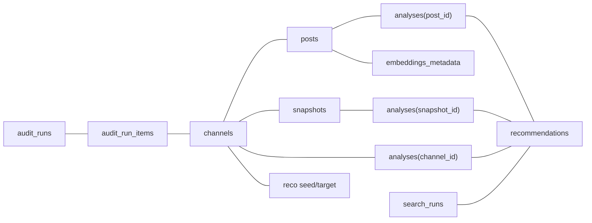

> **Снимок для справки:** сохранено содержимое **`README.md` из истории Git** командой **`git show HEAD:README.md`** (ветка `feature/final`, коммит `70239a49ca42ded7174bb5ab06d67dc6f2c1a78b`). Если у вас в редакторе были более поздние несохранённые или незакоммиченные версии файла до правок помощника — они здесь не воспроизведены; ищите их в **локальной истории IDE** («Local History» / «Timeline») или объедините вручную с актуальным `README.md`.

---

# Telegram Channel Intelligence Dashboard

## О продукте

Платформа для поиска, сбора, анализа и интеллектуальной обработки данных Telegram-каналов с использованием AI-пайплайна, semantic search и витрины данных.

Монорепозиторий: **FastAPI** (Python), **SQLite** + **SQLAlchemy**, **Telethon**, **OpenAI**, **Qdrant**, фронтенд на **Next.js** (TypeScript, Tailwind CSS).

---

## Требования

| Компонент | Версия / примечание |
|-----------|----------------------|
| Python | 3.10+ (в Docker используется 3.12) |
| Node.js | 20+ (для Next.js 15) |
| npm | установка фронтенда из каталога `apps/web` |
| Docker и Docker Compose | опционально, для полного стека и Qdrant |

---

## Запуск проекта на текущем этапе

На этом этапе доступны: каркас API (`/api/v1/health`, черновик работы с каналами), Next.js-интерфейс и страница проверки связи с API (`/health`). Интеграции Telethon / OpenAI / Qdrant подключены в коде как заготовки и требуют ключей в `.env` для реальной работы.

### 1. Клонирование и переменные окружения

```bash
git clone <url-репозитория>
cd tg-channel-intelli-dashboard
cp .env.example .env
```

Отредактируйте `.env` при необходимости:

- **`DATABASE_URL`** — по умолчанию SQLite в `backend/data/app.db` (относительно рабочей директории процесса backend).
- **`QDRANT_URL`** — для локального API без Docker укажите `http://localhost:6333`, если Qdrant запущен отдельно.
- **`OPENAI_API_KEY`** — см. [платформу OpenAI](https://platform.openai.com/api-keys); нужен для эмбеддингов и LLM.
- **`TELEGRAM_API_ID`**, **`TELEGRAM_API_HASH`**, **`TELEGRAM_SESSION_NAME`** — для клиента Telethon; как получить первые два поля — в следующем подразделе.
- **`NEXT_PUBLIC_API_BASE_URL`** — базовый URL API для браузера (обычно `http://localhost:8000`).
- **`API_URL`** — для серверных запросов Next.js в Docker: в `docker-compose` уже выставлен `http://api:8000`; локально без Docker можно не задавать.

#### Telegram (Telethon): `TELEGRAM_API_ID`, `TELEGRAM_API_HASH`, `TELEGRAM_SESSION_NAME`

Это учётные данные **пользовательского API Telegram** (MTProto), которые Telegram выдаёт для **ваших собственных приложений** (не путать с токеном [@BotFather](https://t.me/BotFather) — он нужен только для ботов).

**Как получить `TELEGRAM_API_ID` и `TELEGRAM_API_HASH`**

1. Откройте **[my.telegram.org](https://my.telegram.org)** и войдите под своим **номером телефона**, привязанным к Telegram (придёт код в приложение Telegram).
2. Перейдите в раздел **«API development tools»** (или «Developing apps»).
3. Если приложение ещё не создано, заполните короткую форму (название приложения и т.п.) и подтвердите.
4. На странице вы увидите:
   - **`api_id`** — целое число → подставьте в **`TELEGRAM_API_ID`** в `.env`;
   - **`api_hash`** — строка из букв и цифр → в **`TELEGRAM_API_HASH`**.
5. Храните пару **api_id / api_hash** как секрет: их нельзя публиковать в репозитории и светить в скриншотах.

**`TELEGRAM_SESSION_NAME`** — базовое имя файла сессии Telethon на диске (без расширения). После первого интерактивного входа рядом появится файл вида `<имя>.session`. Задайте своё имя, если несколько окружений или аккаунтов.

Без заполненных **`TELEGRAM_API_ID`** и **`TELEGRAM_API_HASH`** фабрика клиента Telethon в проекте вернёт `None` (см. `app/integrations/telethon_client.py`), пока вы не добавите реальный код авторизации и вызовов.

#### Qdrant: `QDRANT_URL` и `QDRANT_API_KEY`

**`QDRANT_URL`** — адрес HTTP API Qdrant (порт по умолчанию **6333**). Для сервиса из `docker-compose` из контейнера API обычно указывают `http://qdrant:6333`; при запуске API на хосте и Qdrant в Docker — `http://localhost:6333`.

**`QDRANT_API_KEY`** — это **не «лицензия» и не ключ от движка векторов**, а **секрет для авторизации HTTP-запросов к Qdrant**, если на стороне сервера включена проверка API-ключа.

| Сценарий | Что делать с `QDRANT_API_KEY` |
|----------|--------------------------------|
| Локальный Qdrant из этого репозитория (`docker compose up qdrant` или полный compose) | Оставьте **пустым**: образ по умолчанию **без** обязательного ключа. |
| [Qdrant Cloud](https://cloud.qdrant.io/) или свой кластер с включённой аутентификацией | Укажите **ключ из панели / конфигурации** — тот же ключ должен быть настроен на стороне Qdrant, иначе запросы от backend будут отклоняться (`401`). |
| Продакшен за reverse proxy с проверкой заголовка | Задайте ключ и передавайте его в переменной окружения Qdrant согласно [документации Qdrant](https://qdrant.tech/documentation/guides/security/). |

В коде backend ключ передаётся клиенту только если переменная непустая (см. `app/integrations/qdrant_client.py`). Пустое значение означает «подключаться без заголовка `api-key`».

### 2. Локальный запуск только backend (API)

```bash
cd backend
python3 -m venv .venv
source .venv/bin/activate   # Windows: .venv\Scripts\activate
pip install -e ".[dev]"
```

Файл `.env` должен лежать в **корне репозитория** или рядом с приложением — настройки читают `.env` из текущего окружения и родительских путей (см. `app/core/config.py`). Удобно скопировать `.env` в корень репозитория перед запуском.

Примените миграции и запустите сервер:

```bash
export PYTHONPATH=.
python3 -m alembic upgrade head
uvicorn app.main:app --reload --host 0.0.0.0 --port 8000
```

Проверка: откройте в браузере или через curl документацию OpenAPI — `http://localhost:8000/docs`, либо эндпоинт здоровья — `http://localhost:8000/api/v1/health`.

### 3. Локальный запуск только frontend (Next.js)

В отдельном терминале:

```bash
cd apps/web
npm install
```

Убедитесь, что в корне репозитория есть `.env` с **`NEXT_PUBLIC_API_BASE_URL=http://localhost:8000`** (или экспортируйте переменную перед `npm run dev`). Запуск режима разработки:

```bash
npm run dev
```

Приложение: **http://localhost:3000**. Страница проверки связи с API: **http://localhost:3000/health** (серверный запрос к backend; backend должен быть запущен).

**Примечание.** В корне объявлен npm workspace с пакетом `@tgci/web`; при старых версиях npm workspaces могут работать неполно. Надёжный способ — выполнять `npm install` и скрипты из каталога **`apps/web`**, как показано выше.

### 4. Запуск через Docker Compose (API + Qdrant + Web)

Из **корня** репозитория, где лежат `docker-compose.yml` и `.env`:

```bash
docker compose up --build
```

Поднимутся сервисы:

| Сервис | Назначение | Порт (хост) |
|--------|------------|-------------|
| `qdrant` | векторная БД | 6333 (HTTP), 6334 (gRPC) |
| `api` | FastAPI | 8000 |
| `web` | Next.js | 3000 |

База SQLite монтируется в `./backend/data`. Перед первым запуском контейнера API entrypoint выполняет **`alembic upgrade head`**.

После старта:

- фронтенд: http://localhost:3000  
- API и Swagger: http://localhost:8000/docs  
- проверка здоровья API: http://localhost:8000/api/v1/health  

Если страница `/health` во фронтенде не видит API, проверьте `.env`: для контейнера `web` заданы `API_URL=http://api:8000` и `NEXT_PUBLIC_API_BASE_URL=http://localhost:8000`.

**Если `:3000` не открывается, а `:8000/docs` работает.** Чаще всего контейнер `web` упал при старте (например, не найден `server.js` в образе). Проверьте статус и логи:

```bash
docker compose ps -a
docker compose logs web
```

После правок Dockerfile или `apps/web/next.config.ts` пересоберите фронт и поднимите сервис заново:

```bash
docker compose build web --no-cache
docker compose up -d web
```

### 5. Только Qdrant локально (без полного Compose)

Если нужен только векторный сервис для разработки:

```bash
docker compose up qdrant
```

В `.env` для backend укажите `QDRANT_URL=http://localhost:6333`.

---

## Схема данных SQLite (ORM)

> Соответствие функциональным сценариям закреплено в текстовом каталоге [`context/user_scenario.txt`](context/user_scenario.txt) (и дубль в PDF там же при наличии). Ниже — как сущности покрывают сценарии 1–8.

### Единое место с моделями

В Python **нельзя** одновременно иметь модуль **`models.py`** и пакет **`models/`** с тем же именем. Поэтому ORM описан **пакетом** [`backend/app/models/`](backend/app/models/): каждая таблица в своём файле, сборка экспортов и список сущностей — в [`__init__.py`](backend/app/models/__init__.py). Это и есть логический аналог «одного большого `models.py`».

| Таблица | Назначение и сценарии | Связи и ключевые поля |
|---------|------------------------|-------------------------|
| **audit_runs** | Сцен. **1, 8** (и общий журнал аудита: **5** сравнение и др. через `audit_kind`) | `audit_kind`, `raw_user_input_json`, `planner_output_json`, `quality_gate_json` (manual review), `result_summary_json`, `status`; дочерние строки → **audit_run_items**. |
| **audit_run_items** | Гранулярные «records» результатов поиска канала (сцен. **1**) | FK **→ audit_runs** cascade; FK **→ channels** SET NULL; `snapshot_json` (карточка канала во время выдачи), `relevance_score`, `display_order`; `telegram_username_fallback` если канала ещё нет в `channels`. |
| **channels** | Каналы, карточка сцен. **1**, сбор сцен. **2** | `telegram_id` (unique), `username`; **карточка**: `invite_slug`, `last_post_at`, `posts_per_week_estimate`, `primary_topic`, `topic_search` (исходная строка Telegram-поиска), `topics_json`, `contact_info_json`, язык/регион; `is_public_accessible` (проверка доступа сцен. 2); `sync_status`, `subscriber_count`, `extras_json`. |
| **posts** | Сообщения, сцен. **2–3** и RAG (**4**) | FK **→ channels**; `views_count` / `forwards_count` из TG; текст, медиа, `raw_payload_json`. |
| **snapshots** | Временные срезы (частота, подписчики и т.д.) | FK **→ channels**; **kind**, `metrics_json`, `sampled_at`. |
| **analyses** | Пайплайны LLM: сводки постов (**3**), отчёт по каналу (**2**); сравнение (**5**) через `analyzer_id` + JSON | XOR субъект: channel \| post \| snapshot (`CHECK`). `result_json`, `input_refs_json`, `llm_model`. |
| **recommendations** | Рекомендации, в т.ч. **похожие каналы (6)** | FK **→ analyses**, **→ search_runs**; **`seed_channel_id`**, **`target_channel_id`** (ON DELETE SET NULL). |
| **search_runs** | Сцен. **4** semantic search | Запрос, фильтры, метрики; **`answer_synthesis_json`**, **`retrieved_sources_json`** (ответ и источники после retrieval + LLM). |
| **export_jobs** | Сцен. **7** экспорт | `export_format`, `scope_json`, `artifact_path`, `status`, TTL `expires_at`. |
| **embeddings_metadata** | Связка поста с Qdrant (**3–4–6**) | FK **→ posts**; точка коллекции, модель, `chunk_index`. |

На всех сущностях с таймстампами используется миксин **`created_at` / `updated_at`** (`app/models/base.py`).

У внешних ключей включён режим **`PRAGMA foreign_keys=ON`** для соединений SQLite ([`database.py`](backend/app/core/database.py)).

### Диаграмма связей (упрощённо)



### Миграции Alembic

Из каталога **`backend/`** (переменные окружения и `DATABASE_URL` как для приложения):

```bash
PYTHONPATH=. python3 -m alembic upgrade head          # применить
PYTHONPATH=. python3 -m alembic revision --autogenerate -m "описание"  # после правок моделей
PYTHONPATH=. python3 -m alembic downgrade -1          # откат на один шаг
```

В Docker перед API выполняется `alembic upgrade head` (см. `backend/docker-entrypoint.sh`).

Основные ревизии:

- **`257b8a875354`** — начальная таблица `channels`.
- **`0e1a9783a0bb`** — доменные таблицы, расширение `channels`.
- **`15766a843b39`** — сценарии из `user_scenario.txt`: `audit_runs` / `audit_run_items`, `export_jobs`, поля канала/поста/рекомендаций/семантического поиска.

Если применение миграции на SQLite прервалось посередине, таблицы могли частично появиться при неизменном `alembic_version`: удалите файл БД или откатите вручную фрагменты и выполните `alembic upgrade head` заново.

### Масштабирование и эволюция

- **SQLite** подходит для одного записывающего процесса (типичный воркер синхронизации + API только читает или пишет в очередь). При росте конкуренции записей планируйте **PostgreSQL** / управляемый сервис и замените `DATABASE_URL`; ORM модели без сильной привязки к SQLite совместимы с переносом (JSON, `CheckConstraint`).
- **`posts`** — самая большая таблица: партиционирование на уровне СУБД в SQLite недоступно; стратегия — архивирование старых `channel_id` в отдельный файл/БД, **VACUUM**, при необходимости вынесение полнотекста в FTS5 или внешний поисковик.
- **`search_runs`** — журнал: включайте TTL/выгрузку в аналитическое хранилище или обрезку по времени.
- **`embeddings_metadata`** — только ссылки на Qdrant; при смене коллекции поддерживайте миграции точек в Qdrant и консистентность с этой таблицей транзакциями приложения или фоновыми задачами.
- **Тяжёлые поля JSON** держите схематично документированными (конвенции ключей в команде); при необходимости версионируйте `analyzer_id` / типы snapshot `kind`.

## Структура репозитория (кратко)

- **`backend/`** — приложение FastAPI, слои `api`, `services`, `repositories`, `models`, `schemas`, интеграции и AI-пайплайны.
- **`apps/web/`** — Next.js с Tailwind.
- **`docker-compose.yml`** — оркестрация сервисов.
- **`.env.example`** — образец переменных окружения.

Дополнительные команды только для backend см. в [backend/README.md](backend/README.md).

## Документация

| Тема | Файл |
|------|------|
| **Метрики каналов** — формулы (`avg_views`, частота постов, вовлечённость, активность, регулярность), расшифровка переменных, веса `MetricWeights` | [backend/docs/CHANNEL_METRICS.md](backend/docs/CHANNEL_METRICS.md) |
| **Telegram (Telethon)** — сессия, переменные окружения, FastAPI | [backend/docs/TELEGRAM_TELETHON.md](backend/docs/TELEGRAM_TELETHON.md) |
| **AI pipeline** — RAG, tools, стадии, SQL vs Qdrant, библиотеки, confidence | [backend/docs/AI_PIPELINE_ARCHITECTURE.md](backend/docs/AI_PIPELINE_ARCHITECTURE.md) |

<h2 id="backend-tests">Тесты (backend)</h2>

Запуск из каталога **`backend/`** (нужен dev-набор зависимостей: `pip install -e ".[dev]"`):

```bash
cd backend
PYTHONPATH=. python3 -m pytest tests/ -q
```

Только метрики каналов:

```bash
PYTHONPATH=. python3 -m pytest tests/test_channel_metrics_compute.py -v
```

Только интеграционные юнит-тесты Telethon (моки, без реальной сети):

```bash
PYTHONPATH=. python3 -m pytest tests/test_telethon_*.py -q
```

### Что проверяют основные тесты

| Файл | Назначение |
|------|------------|
| `tests/test_channel_metrics_compute.py` | Движок метрик: пустые выборки, среднее просмотров, частота при двух постах и при «серии» в один день, прокси вовлечённости по `forwards`/`views`, регулярность интервалов (ровные / неровные / один пост), композитный `activity_score`, полный снимок `compute_channel_metrics`, валидация суммы весов в `MetricWeights`. |
| `tests/test_telethon_exceptions.py` | Маппинг ошибок Telethon → доменные исключения (`FloodWait`, username, private channel, `coerce_to_telegram_error`). |
| `tests/test_telethon_rate_limit.py` | Повтор запросов после `FloodWait` с подменой `asyncio.sleep`, исчерпание попыток, проброс немаппируемых ошибок. |
| `tests/test_telethon_user_session_service.py` | Сервис Telethon на заглушках клиента: фильтр мегагрупп в поиске, `resolve_channel` для не-канала, защита при отсутствии клиента, `_guarded_call` с ретраем FloodWait. |

Конфигурация `pytest` (в т.ч. `asyncio_mode = auto`) задаётся в [`backend/pyproject.toml`](backend/pyproject.toml) в секции `[tool.pytest.ini_options]`.
