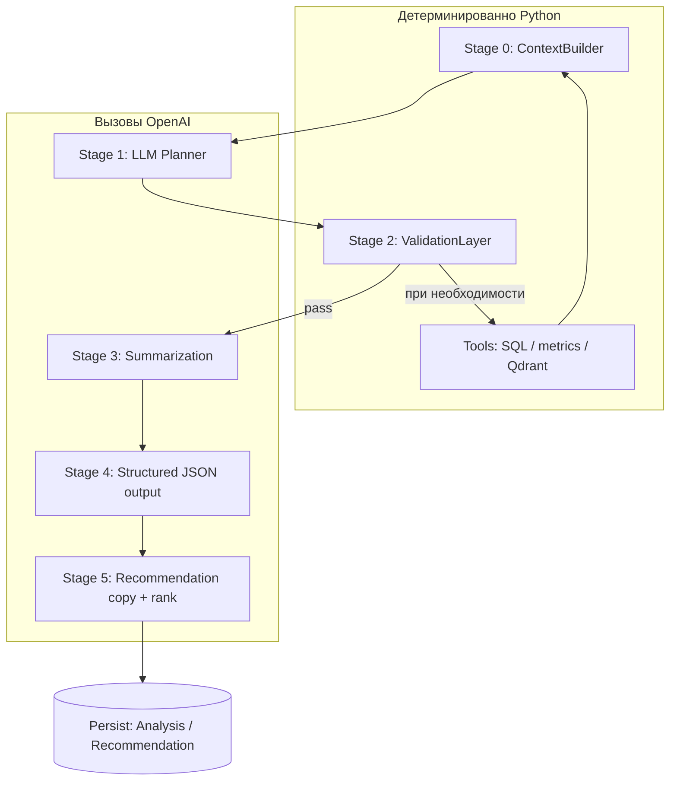

# Архитектура AI pipeline для анализа Telegram-каналов

Документ фиксирует **целевую сервисную архитектуру** под OpenAI API, с явным ответом на вопросы: используются ли **RAG** и **tools**, какие **стадии pipeline**, что лежит в **SQL** и что в **векторной БД**, какие **библиотеки** и почему. Это не обязательно уже весь реализованный код репозитория — это **направление проектирования**, согласованное с текущими моделями (`Analysis`, `Recommendation`, `Post`, `Channel`, Qdrant в зависимостях).

---

## 1. Цели и ограничения

| Цель | Как архитектура это поддерживает |
|------|----------------------------------|
| Воспроизводимость анализов | Версионированные промпты, фиксация `llm_model`, сырые входы в `input_refs_json`, результат в `result_json`. |
| Контроль качества | Отдельная стадия валидации + схемный контракт (Pydantic) + явный **confidence**. |
| Стоимость и предсказуемость | LLM только на стадиях, где нужен язык; метрики и фильтры — Python; ограничение контекста в `ContextBuilder`. |
| Расширение без «зоопарка» | Линейный pipeline с чёткими границами; при росте — подключаются RAG и новые tools без смены парадигмы. |

Ограничение из продуктовой логики: **не** опираться на тяжёлый agent-framework как обязательную основу MVP; оркестрация остаётся в коде приложения (FastAPI / worker), чтобы проще тестировать и объяснять пайплайн на защите.

---

## 2. Используются ли RAG и tools?

### 2.1. RAG (Retrieval-Augmented Generation)

**Да, предполагается — выборочно**, не как «единственный мозг» приложения.

| Сценарий | Нужен ли RAG | Почему |
|----------|--------------|--------|
| Сводка / аудит **одного** канала по уже загруженным постам в SQL | Часто **нет**: контекст собирается запросом в БД и укладывается в окно (возможно с summarization). | Данные уже «ваши»; retrieval не добавляет новых фактов. |
| Вопросы **по корпусу** многих каналов / истории («что писали про X за квартал», «похожие формулировки») | **Да** | Полный перебор SQL по смыслу невозможен; нужен **семантический поиск** → эмбеддинги → top‑k чанков → ответ LLM. |
| Рекомендации «похожий канал» по смыслу профиля | **Да** (или гибрид) | Векторное сравнение профилей / summary эффективнее чистого SQL по тексту. |

**Вывод:** RAG — это **слой retrieval поверх векторного индекса** (у вас в стеке **Qdrant**), который подмешивает найденные фрагменты в промпт **определённых** стадий (например ответ semantic search, расширение контекста для recommendation). Для одиночного канала pipeline может **обойтись без** вызова Qdrant.

### 2.2. Tools (инструменты для LLM / для оркестратора)

**Да, предполагается** в смысле **выполняемых функций с доступом к данным и внешним системам**, а не обязательно в смысле «OpenAI Function Calling на каждом шаге».

Два допустимых режима (можно комбинировать):

1. **Оркестратор вызывает tools** (рекомендуется для MVP): Python после стадии Planner читает план и вызывает зарегистрированные функции (`fetch_posts`, `compute_metrics`, `qdrant_search`, …). LLM не «сам ходит» в БД — меньше риска и проще аудит.
2. **Function calling / Responses API** (опционально позже): модель возвращает `tool_calls` → сервер выполняет → возвращает результат в диалог. Имеет смысл, если появятся интерактивные multi-turn сценарии.

**Список типовых tools (логические роли):**

| Tool | Назначение |
|------|------------|
| `telegram_context` / загрузка постов | Уже частично покрыто Telethon-слоем + записью в SQL; pipeline читает готовые `Post`. |
| `channel_metrics` | Детерминированные метрики (`app.services.channel_metrics`) — не LLM. |
| `sql_filter` | Выборки по датам, `channel_id`, лимиты — SQL. |
| `vector_search` | Qdrant: top‑k чанков по запросу пользователя или по профилю канала. |
| `persist_analysis` | Сохранение `Analysis` / `Recommendation`. |

Итог: **tools обязательны как концепция исполнителей**; физически на старте они могут быть **обычными Python-функциями**, вызываемыми оркестратором по структурированному плану, без обязательного function calling.

---

## 3. Стадии pipeline (порядок и ответственность)

Ниже — **логический** конвейер одного «запуска анализа» (один `analyzer_id`, один субъект `channel` | `post` | `snapshot`). Ветвления: только если Validation требует дозагрузки данных или блокирует LLM.

| № | Стадия | LLM? | Вход | Выход |
|---|--------|------|------|--------|
| 0 | **ContextBuilder** | Нет | `channel_id` / список постов, лимиты токенов, настройки | `ContextBundle`: тексты, метаданные, числовые метрики, флаги «мало данных» |
| 1 | **LLM Planner** | Да | Запрос пользователя + `ContextBundle` (сжатый) | Структурированный **Plan**: шаги, нужен ли RAG, лимиты, `plan_confidence` (слабый сигнал) |
| 2 | **ValidationLayer** | Опционально да | Plan + факты из SQL | `pass` / `warn` / `block` + причины; при `block` — стоп без лишних вызовов LLM |
| 3 | **Summarization** | Да (может быть несколько вызовов) | Длинный корпус постов | Сжатые summary для следующих стадий |
| 4 | **Structured output** | Да | Summary + метрики + (если план) фрагменты из RAG | JSON, строго по Pydantic-схеме артефакта (`analyzer_id`) |
| 5 | **Recommendation engine** | Да и/или нет | Артефакт + метрики + (опционально) векторное сходство | Строки логики рекомендаций + запись в `Recommendation` |

**Персистентность:** после стадии 4 и/или 5 — обновление `Analysis` (`status`, `result_json`, `error_detail`), создание `Recommendation`, при необходимости — джобы на обновление эмбеддингов в Qdrant (отдельно от критического пути ответа пользователю).

---

## 4. Что хранить в SQL и что в векторной БД (и почему)

### 4.1. SQL (SQLite сейчас; принцип тот же для PostgreSQL)

**Назначение:** источник правды, **факты**, связи, фильтры, идемпотентность, транзакции.

| Сущность / данные | Почему SQL |
|-------------------|------------|
| `channels`, `posts` | Стабильные записи с FK, уникальность `(channel_id, telegram_message_id)`, индексы по дате. |
| Числа: просмотры, пересылки, подписчики, даты | Точные фильтры и агрегаты; векторный поиск по числам неэффективен. |
| `analyses` | Журнал прогонов, `analyzer_id`, `status`, JSON результата, связь с субъектом. |
| `recommendations` | Выдача пользователю с типом, score, FK на анализ / поиск. |
| `search_runs`, `audit_runs`, … | Сценарии продукта, воспроизводимость. |
| `snapshots` | Срезы метрик во времени — структурированные данные. |

### 4.2. Векторная БД (Qdrant)

**Назначение:** **семантический индекс** — «похожесть по смыслу», RAG, кластеризация тем, поиск без точного совпадения слов.

| Что индексировать | Почему не только SQL |
|-------------------|----------------------|
| Текст поста (чанки) или **summary** поста | Запросы вида «темы как у …», «где обсуждали инвестиции в …» |
| **Channel profile** (текстовая сводка: о чём канал, стиль) | Сравнение каналов, поиск похожих |
| Фрагменты отчётов / аудитов (опционально) | Поиск похожих кейсов по смыслу |

| Что **не** дублировать в векторах как основной смысл | Почему |
|-----------------------------------------------------|--------|
| Сырые ID, только числа без текстового контекста | Им нечему быть «похожим» в embedding-пространстве; фильтрация — в SQL. |

**Связка SQL ↔ Qdrant:** в payload точки Qdrant хранить **`channel_id` / `post_id`** (и при необходимости `analysis_id`) — после retrieval всегда можно подтянуть полные факты из SQL.

---

## 5. Компоненты из ТЗ — расшифровка

### 5.1. LLM Planner

- **Задача:** перевести намерение пользователя и контекст в **явный машиночитаемый план** (какие данные нужны, нужен ли semantic search, глубина истории).
- **Не делает:** не пишет в БД, не вызывает Telegram напрямую (это tools / другие сервисы).
- **Выход:** JSON по схеме `Plan` (Pydantic).

### 5.2. Validation Layer

- **Сначала правила:** минимальное число постов, максимальный размер контекста, запрещённые состояния (нет канала, пустой текст).
- **Потом опционально LLM:** короткий вызов «соответствует ли план данным?» — только если правил недостаточно (экономия).
- **Связь с confidence:** `block`/`warn` снижают итоговый confidence.

### 5.3. Summarization

- Отдельные промпты от Planner; при длине корпуса > окна — **map** (по батчам постов) + **reduce**.
- Результат — текст для стадии Structured output, а не финальный JSON всего отчёта (меньше ошибок парсинга).

### 5.4. Structured JSON Output

- Один «главный» артефакт сценария (аудит, карточка, таблица полей) в строгой схеме.
- **OpenAI Structured Outputs** (где доступно для выбранной модели) + **Pydantic** на стороне Python — двойное согласование контракта.
- При ошибке парсинга: **одна** repair-попытка с узким системным промптом (не смешивать с сетевым ретраем).

### 5.5. Recommendation Engine

- **Вход:** структурированный артефакт + метрики + опционально список кандидатов из Qdrant.
- **Логика:** жёсткие правила (например, не рекомендовать канал без N постов) + LLM для формулировок и ранжирования **или** чисто векторный top‑k с объяснением через LLM поверх найденных имён.
- **Выход:** записи `Recommendation` + связь с `Analysis`.

---

## 6. Библиотеки: что использовать и почему

Ниже — **минимальный разумный стек** под уже объявленные зависимости в `pyproject.toml`. Дополнения помечены как рекомендуемые для production-удобства.

| Библиотека | Роль в архитектуре | Обоснование |
|------------|-------------------|-------------|
| **`openai` (официальный, async)** | Вызовы Chat Completions / Responses, structured outputs | Поддержка API, типы, async; не оборачивать без нужды в LangChain. |
| **`pydantic` v2** (уже через FastAPI / settings) | Схемы Plan, AuditResult, …; `model_validate_json` | Единый язык контрактов с FastAPI; быстрая валидация после LLM. |
| **`httpx`** (уже в проекте) | Побочные HTTP-вызовы, если появятся | Async-стек консистентен с OpenAI SDK. |
| **`qdrant-client`** (уже в проекте) | Запись/поиск векторов, payload с FK в SQL | Уже выбрано в монорепо как vector store. |
| **`sqlalchemy[asyncio]`** | Доступ к фактам, сохранение `Analysis` | Уже ядро backend. |
| **`Jinja2`** (рекомендуется добавить зависимостью) | Шаблоны промптов по `analyzer_id` и версии | Логика отделена от кода; условные блоки, подстановка контекста. |
| **`tenacity`** (рекомендуется добавить) | Ретраи 429/5xx, экспоненциальный backoff | Декларативно отделить транспортные повторы от repair JSON. |

**Почему не LangChain / LangGraph по умолчанию:** для вашего объёма сценариев они дают мало уникального при высокой стоимости отладки и версионирования; явный pipeline проще покрыть тестами и объяснить. При росте сложности можно **точечно** вынести подграф (например только RAG-ветку) без переписывания всего backend.

---

## 7. Prompt templates, schema validation, retry, confidence

### 7.1. Prompt templates

- Файлы в репозитории: например `backend/app/ai/prompts/<analyzer_id>/v1/planner.j2`.
- В метаданных прогона сохранять **`prompt_version`** (в `input_refs_json` или внутри `result_json`).

### 7.2. Schema validation

- Каждая стадия с JSON: своя Pydantic-модель.
- Где возможно — генерация JSON **по схеме** на стороне OpenAI (меньше «битого» JSON).

### 7.3. Retry mechanism

| Тип сбоя | Поведение |
|----------|-----------|
| 429, 5xx, timeout, сеть | Exponential backoff, ограниченное число попыток (**tenacity** или своя обёртка). |
| Невалидный JSON / Pydantic | Одна **repair**-попытка с явным списком ошибок валидатора; не считать это за «ещё один полный прогон». |

### 7.4. Confidence scoring

Композитный скор (пример сигналов):

- достаточность данных (число постов, глубина дат) — **правила**;
- успех валидации первого прохода;
- успех парсинга JSON с первого ответа;
- `plan_confidence` от модели — **низкий вес** (модели склонны завышать).

Итог кладётся в `result_json` (и при эволюции схемы — в отдельные поля БД).

---

## 8. Связь с существующими моделями БД

- **`Analysis`**: один субъект (`channel_id` XOR `post_id` XOR `snapshot_id`), `analyzer_id`, `status`, `input_refs_json`, `result_json`, `llm_model`, `error_detail`.
- **`Recommendation`**: потомки логики recommendation stage, связь с `source_analysis_id` (и при необходимости `search_run_id`).
- **Qdrant**: не заменяет SQL; хранит вектор + payload с ключами для join к SQL.

---

## 9. Краткий итог

| Вопрос | Ответ |
|--------|--------|
| RAG? | **Да, точечно** — для вопросов по корпусу / похожести / расширения контекста через Qdrant; для «один канал в лимите окна» может не вызываться. |
| Tools? | **Да** — как выполняемые функции (SQL, метрики, Qdrant, сохранение); на MVP оркестратор вызывает их по плану; function calling — опционально позже. |
| Стадии | ContextBuilder → Planner → Validation → Summarization → Structured JSON → Recommendations → Persist. |
| SQL vs вектор | **Факты и связи** в SQL; **семантический поиск и RAG** — Qdrant + payload с id из SQL. |
| Библиотеки | `openai`, `pydantic`, `sqlalchemy`, `qdrant-client`; рекомендованы `Jinja2`, `tenacity`; без обязательного LangChain. |

Дальнейшая детализация по конкретным `analyzer_id` и JSON-схемам — в отдельных спецификациях или в коде `app/ai/schemas/` по мере реализации.

---

## 10. Реализация в репозитории (эталон `channel_audit_v1`)

Рабочий каркас pipeline: пакет **`app/ai/`** — оркестратор `ChannelAnalysisPipeline`, стадии в `app/ai/stages/`, промпты Jinja2 в `app/ai/prompts/channel_audit_v1/`, клиент OpenAI с ретраями `app/ai/clients/openai_chat.py`, агрегация confidence `app/ai/confidence.py`. Точка входа: `await ChannelAnalysisPipeline().run(ChannelPipelineInput(...))` (см. docstring в `app/ai/orchestration/pipeline.py`). Юнит-тесты без сети: `tests/test_ai_pipeline_unit.py`.
