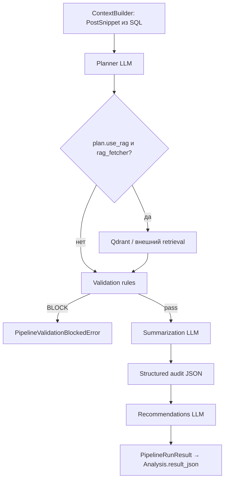

# Архитектура AI pipeline для Telegram Channel Intelligence Dashboard

Документ описывает **текущую реализацию** в репозитории: где вызывается OpenAI, где используется Qdrant и RAG, какие стадии есть у каждого сценария, и как это связано с SQL. Отдельно отмечаются **общие принципы** (контракты Pydantic, аудит), которые сохраняются при доработках.

---

## 1. Цели и ограничения

| Цель | Как это поддерживается в коде |
|------|--------------------------------|
| Воспроизводимость | Запись прогонов в `analyses`, `audit_runs` / `audit_run_items`, `search_runs`; JSON-артефакты в полях `result_json` / `snapshot_json`. |
| Контроль качества | Pydantic-схемы на выходе LLM там, где используется structured output; эвристики + `needs_review` до дорогих вызовов. |
| Предсказуемая стоимость | LLM не на каждом HTTP-запросе подряд: есть чисто детерминированные ветки, fallback без ключа, ранние `needs_review`. |
| Расширяемость | Несколько независимых «потоков» (анализ канала, планировщик поиска, семантика, discovery-оркестратор); опциональный RAG-хук в анализе канала. |

Ограничение: оркестрация критичных цепочек остаётся **в коде приложения** (FastAPI + in-process `OrchestrationCoordinator`), без обязательного agent-framework.

---

## 2. Карта AI-подсистем (что где живёт в коде)

В репозитории **не один** монолитный pipeline, а несколько согласованных подсистем:

| Подсистема | Назначение | Ключевые модули |
|------------|------------|-----------------|
| **Аудит канала (analyzer `channel_audit_v1`)** | Глубокий отчёт по одному каналу и постам из SQL: план → валидация → summary → JSON-аудит → рекомендации. | `app/ai/orchestration/pipeline.py` (`ChannelAnalysisPipeline`), `app/ai/stages/*`, промпты `app/ai/prompts/channel_audit_v1/*.j2` |
| **Планирование поиска каналов** | Нормализация формы поиска в `SearchPlannerOutput` (тема, count, подписчики, confidence). | `app/services/channel_search_planner.py` (`plan_channel_search`, `merge_planner_with_user_request`) |
| **Quality gate поиска** | «Слишком общий запрос», конфликт темы и `extra_conditions` (LLM при непустом extra и наличии ключа). | `app/services/intelligence_service.py` (`_manual_review_too_broad`, `_review_extra_conditions`, `search_channels`) |
| **Discovery (Telegram live)** | Фоновая цепочка после постановки job: planner → Telethon → SQLite + audit → метрики → **короткий LLM-лейбл темы** → **векторный индекс профилей**. | `app/orchestration/coordinator.py`, `app/orchestration/discovery_pipeline.py` |
| **Сводка постов (сценарий 3)** | Эмбеддинги и upsert **сводок постов** и **окон контента** в Qdrant для последующей семантики. | `app/services/intelligence_service.py` (ветки scenario 3), `app/integrations/qdrant_client.py` |
| **Семантический поиск (сценарий 4)** | Маршрутизация запроса → embedding вопроса → поиск в Qdrant → (в режиме QA) **LLM по evidence**. | `semantic_search_scenario4` в `intelligence_service.py` |
| **Сравнение каналов (сценарий 5)** | Сначала **детерминированные** метрики и эвристики; при наличии ключа — **один LLM-вызов** для текстовой сводки сравнения. | `compare_channels` в `intelligence_service.py` |

Точка входа для «классического» AI-аудита в коде задокументирована в docstring `ChannelAnalysisPipeline` (`app/ai/orchestration/pipeline.py`).

---

## 3. RAG, tools и векторная БД — как это устроено сейчас

### 3.1. RAG (Retrieval-Augmented Generation)

**Реализовано явно** в сценарии 4 (семантический поиск):

1. Запрос пользователя превращается в вектор (OpenAI Embeddings).
2. Из Qdrant извлекаются top‑k точек из коллекций с данными сценария 3.
3. Для режима ответа на вопрос по корпусу контент **склеивается в evidence** и передаётся в chat completion с инструкцией отвечать только по evidence.

В **аудите канала** (`ChannelAnalysisPipeline`) RAG **опционален**: после стадии Planner, если `plan.use_rag` и в `ChannelPipelineInput` передан `rag_fetcher`, в контекст добавляются `bundle.rag_snippets` (см. `ChannelPipelineInput` в `app/ai/stages/context_builder.py`). В типовом вызове из API fetcher может быть `None` — тогда Qdrant для этого прогона не используется.

### 3.2. «Tools»

В смысле **выполняемых функций**, а не обязательного OpenAI Function Calling:

- SQL / репозитории, Telethon, расчёт метрик, запись аудита, планировщик поиска, Qdrant search/upsert — вызываются из Python до/после LLM.

Function calling как API-модели **не является обязательной основой** текущего кода.

### 3.3. Qdrant: зачем и какие коллекции

| Коллекция (имя в коде) | Кто заполняет | Зачем |
|------------------------|---------------|--------|
| `telegram_post_summaries` | Сценарий 3 (сводка постов) | Семантический поиск по **кратким сводкам постов** |
| `telegram_channel_windows` | Сценарий 3 | Семантика по **агрегированным окнам** контента канала |
| `telegram_channel_profiles` | Стадия `run_vector_stage` в discovery после live-поиска | Лёгкий **профиль канала** (title/description/topics) для сценария похожих каналов и смежной семантики |

Связь с SQL: в payload точек хранятся `channel_id`, `channel_username`, идентификаторы постов — полные факты при необходимости поднимаются из SQLite.

Дефолтная коллекция в настройках (`qdrant_collection_name`, например `channel_messages`) используется как базовое имя/наследие конфигурации; сценарии 3–4 и discovery работают с **именованными** коллекциями выше.

---

## 4. Подсистема «аудит канала»: `ChannelAnalysisPipeline`

Линейный конвейер для analyzer `channel_audit_v1`:

| № | Стадия | LLM? | Реализация |
|---|--------|------|------------|
| 0 | Контекст | Нет | `build_context_bundle` — обрезка текста, метрики постов, «достаточность данных» |
| 1 | План | Да | `run_planner` + шаблон `channel_audit_v1/planner.j2` |
| 1b | RAG (опционально) | Нет сам по себе | Вызов `rag_fetcher(plan, bundle)` → строки в `bundle.rag_snippets` |
| 2 | Валидация | Нет (правила) | `run_validation` — может заблокировать дорогие стадии |
| 3 | Сводка | Да | `run_summarization` |
| 4 | Структурированный аудит | Да | `run_structured_audit` → `ChannelAuditArtifact` |
| 5 | Рекомендации | Да | `run_recommendations` |

Персистенция: сервис анализа создаёт строку `Analysis`, вызывает `pipeline.run(...)`, сохраняет `result.to_result_dict()` в `result_json` (см. `IntelligenceService`, блок с `ChannelAnalysisPipeline()`).

Промпты: каталог `backend/app/ai/prompts/channel_audit_v1/` — `planner.j2`, `summarization_reduce.j2`, `structured_audit.j2`, `recommendations.j2`, `json_repair.j2`.

---

## 5. Поиск каналов и планировщик

- **`plan_channel_search`** (`channel_search_planner.py`): developer-сообщение с инструкцией вернуть структурированный `SearchPlannerOutput`; user-сообщение — JSON всей формы. Без `OPENAI_API_KEY` — детерминированный fallback из полей формы.
- После плана выполняется **`merge_planner_with_user_request`**: пересечение диапазонов подписчиков, ограничение `count` для `telegram_live` / `saved_catalog`.
- Дополнительно (до запуска каталога/live): **`_manual_review_too_broad`** и при непустых **`extra_conditions`** — **`_review_extra_conditions`** (отдельный structured LLM-вызов для конфликта темы и доп. условий).

Это **отдельный** контур от `ChannelAnalysisPipeline`: другая схема ответа (`SearchPlannerOutput` в `app/ai/schemas/search_planner.py`), другой смысл запроса к LLM.

---

## 6. Оркестрация discovery (Telegram live)

`OrchestrationCoordinator` выполняет этапы для job `telegram_channel_discovery` (см. `coordinator.py`):

1. **planner** — подготовка параметров поиска (в т.ч. вызов планировщика в `discovery_pipeline`).
2. **telethon_ingest** — получение кандидатов.
3. **sqlite_persist** — upsert каналов в SQLite + строки **audit** (`audit_runs` / `audit_run_items` с `snapshot_json`).
4. **metrics** — метрики по постам через Telethon.
5. **ai_pipeline** — **`run_ai_stage`**: короткие chat-запросы к LLM для уточнения `primary_topic` по title/description (при наличии ключа).
6. **vector_index** — **`run_vector_stage`**: эмбеддинг текстовых профилей и upsert в коллекцию **`telegram_channel_profiles`**.

---

## 7. Сценарий 3: сводка постов → наполнение Qdrant

При успешном сценарии сводки в Qdrant пишутся точки в **`telegram_post_summaries`** и **`telegram_channel_windows`** (тексты сводок и метаданные в payload). Это **подготовительный слой** для сценария 4: без данных в этих коллекциях семантический поиск возвращает `needs_review` с пояснением «сначала запустите резюмирование».

---

## 8. Сценарий 4: семантический поиск (RAG end-to-end)

Упрощённая цепочка в `semantic_search_scenario4`:

1. **Маршрутизация** `_semantic_route_mode` — эвристики «слишком общий», личные вопросы к модели, неясность пост vs канал.
2. **Embedding** запроса: `openai.embeddings.create` с моделью из `Settings.openai_embedding_model`.
3. **Поиск** в Qdrant: параллельно по `telegram_post_summaries` и `telegram_channel_windows`.
4. **Результат**:
   - режимы `post_search` / `channel_search` — в основном ранжирование и агрегация без большого LLM;
   - режим вопроса по корпусу — **synthesis**: system «Ты аналитик. Отвечай только по данным evidence», user с вопросом и обрезанным evidence.

---

## 9. Сценарий 5: сравнение каналов

1. Сбор постов за окно (Telethon и/или SQLite), расчёт метрик (частота, охваты, ER, стабильность, тон, темы, коммерческая доля и т.д.).
2. Детерминированные **strengths / recommendations** и `normalized_score`.
3. Если задан `OPENAI_API_KEY`, один **LLM-вызов** переформулирует блок сравнительных «notes» на русском по компактному JSON метрик; при ошибке остаётся шаблонный текст.

---

## 10. SQL vs векторная БД (итог)

- **SQLite**: каналы, посты, анализы, аудит, поисковые прогоны — источник истины и точные фильтры.
- **Qdrant**: семантический индекс для поиска по смыслу, RAG в сценарии 4 и профили для discovery/похожих каналов; payload содержит ключи для join к SQL.

---

## 11. Библиотеки (факт из `pyproject.toml`)

| Библиотека | Роль |
|------------|------|
| `openai` | Chat completions, embeddings, structured parses где используется `OpenAIStageClient` / прямые вызовы в сервисах. |
| `pydantic` / `pydantic-settings` | Схемы запросов/ответов FastAPI и AI-артефактов. |
| `jinja2` | Шаблоны промптов `*.j2` в `app/ai/prompts/`. |
| `tenacity` | Ретраи в клиенте OpenAI (см. `app/ai/clients/openai_chat.py`). |
| `qdrant-client` | `QdrantStore`, поиск и upsert. |
| `sqlalchemy[asyncio]` | ORM и репозитории. |

---

## 12. Confidence, retry, версии промптов

- **Аудит канала**: итоговый `confidence` агрегируется в `app/ai/confidence.py` из достаточности данных, валидации, успеха первого парсинга JSON, `plan_confidence` (с низким весом). Попадает в `PipelineRunResult.to_result_dict()`.
- **Retry**: транспортные повторы — через `tenacity` в OpenAI-клиенте; «repair» JSON — отдельная логика в стадиях structured output при необходимости.
- **Версии**: у `ChannelPipelineInput` есть `prompt_version` (по умолчанию `v1`); шаблоны лежат в каталоге `channel_audit_v1`.

---

## 13. Тесты

- Юнит-тесты пайплайна аудита без сети: `backend/tests/test_ai_pipeline_unit.py`.

---

## 14. Краткий итог

| Вопрос | Ответ по текущему коду |
|--------|-------------------------|
| Один pipeline на всё приложение? | **Нет**. Есть `ChannelAnalysisPipeline` для глубокого аудита, отдельные LLM-вызовы для поиска/валидации формы, discovery, сценариев 3–5. |
| RAG? | **Да** в сценарии 4; **опционально** в аудите канала через `rag_fetcher` + `plan.use_rag`. |
| Qdrant? | Коллекции `telegram_post_summaries`, `telegram_channel_windows`, `telegram_channel_profiles` (+ настройка `qdrant_collection_name` для наследия конфигурации). |
| Где лежат промпты аудита? | `backend/app/ai/prompts/channel_audit_v1/*.j2` |
| Публикация постов в канал? | **Отдельный модуль** [`app/publishing/`](../app/publishing/) — не входит в `ChannelAnalysisPipeline`; промпт [`post_draft.j2`](../app/ai/prompts/publishing/post_draft.j2), Images API, Telethon `publish_to_channel`. См. [PUBLISHING.md](PUBLISHING.md). |

Дальнейшая детализация по полям JSON конкретных ответов API — в `app/schemas/` и в Pydantic-моделях в `app/ai/schemas/`.
