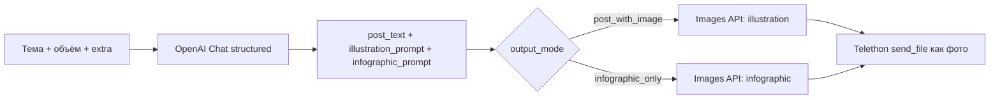

# Публикация в Telegram (модуль «Публикация»)

Документ описывает модуль генерации постов через **OpenAI** и публикации через **Telethon user session** (не Bot API). UI: меню **«Публикация»** → `/publishing` (Next.js).

## Содержание

1. [Назначение](#назначение)
2. [Архитектура backend](#архитектура-backend)
3. [Сценарии в UI](#сценарии-в-ui)
4. [Алгоритм AI-поста](#алгоритм-ai-поста)
5. [REST API](#rest-api)
6. [Telethon](#telethon)
7. [Переменные окружения](#переменные-окружения)
8. [Стиль автора](#стиль-автора)
9. [Тесты](#тесты)

## Назначение

Модуль позволяет пользователю с **авторизованной Telethon-сессией**:

1. **Публиковать посты в свои каналы** — текст, изображение или оба (от имени user session).
2. **Писать сообщения в чаты** — личные сообщения / группы от своего имени.
3. **Генерировать посты через LLM** — текст в стиле автора + иллюстрация или инфографика (OpenAI Chat + OpenAI Images), с предпросмотром и правкой перед публикацией.

Данные **не сохраняются** в SQLite как отдельная сущность: публикация идёт напрямую в Telegram; генерация использует только in-memory / ответ API.

## Архитектура backend

```
app/publishing/
├── __init__.py          # экспорт PublishingService
├── service.py           # оркестрация: generate, publish, list channels
├── generator.py         # PostContentGenerator (OpenAI chat + images)
├── image_api.py         # маппинг size/quality под dall-e-3 vs gpt-image-1
├── style.py             # загрузка образцов стиля автора
├── schemas.py           # PostDraftLLM, GeneratedPostContent (internal)
└── data/
    └── author_style_samples.txt   # bundled fallback

app/schemas/publishing.py        # Pydantic для REST
app/api/v1/endpoints/publishing.py
app/ai/prompts/publishing/post_draft.j2

app/integrations/telethon/
├── media_bytes.py       # BytesIO + MIME → фото в ленте, не «файл»
└── user_session_service.py  # list_publishable_channels, publish_to_channel, send_user_message
```

Зависимости эндпоинтов: **`TelethonUserSessionServiceDep`** (503 без сессии), **`OPENAI_API_KEY`** для генерации (503/422).

## Сценарии в UI

### Вкладка «AI-пост в канал»

| Кнопка | Поведение |
|--------|-----------|
| **Предпросмотр** | `POST /publishing/generate` → редактор: правка **текста**, **замена/удаление** картинки → **«Опубликовать предпросмотр»** (`POST /publishing/publish-manual` с отредактированным телом). |
| **Сгенерировать и опубликовать** | `POST /publishing/publish-generated` — без редактора; вверху экрана блок **«Опубликовано»** (id сообщения, канал, тема). |

**Формат поста:**

- `post_with_image` — в канал уходит **картинка + текст** (подпись к фото).
- `infographic_only` — в канал только **изображение**; текст в UI показывается как черновик смысла (в Telegram не публикуется).

Список каналов: `GET /publishing/channels` (каналы, где сессия — создатель/админ с правом поста). Если список пуст — в UI можно ввести `@username` вручную.

### Вкладка «Ручная публикация»

Готовый текст и/или файл изображения → `POST /publishing/publish-manual`.

### Вкладка «Сообщение в чат»

`@username`, id или ссылка + текст → `POST /publishing/send-message`.

## Алгоритм AI-поста

Оптимизированный пайплайн (один structured-вызов chat + один images):



1. Пользователь задаёт **тему**, **число символов** (200–4096), опционально **доп. информацию**, **формат**.
2. **OpenAI Chat** (`OpenAIStageClient.parse_structured`, модель `OPENAI_CHAT_MODEL`) по шаблону [`post_draft.j2`](../app/ai/prompts/publishing/post_draft.j2) возвращает:
   - `post_text` — текст с эмодзи в стиле автора;
   - `illustration_prompt_en` — промпт иллюстрации (англ.);
   - `infographic_prompt_en` — промпт инфографики (англ.).
3. **OpenAI Images** (`OPENAI_IMAGE_MODEL`) генерирует PNG/JPEG; параметры `size`/`quality` нормализуются в [`image_api.py`](../app/publishing/image_api.py) под семейство модели.
4. **Telethon** публикует через `send_file` с `force_document=False`, именем файла и MIME ([`media_bytes.py`](../app/integrations/telethon/media_bytes.py)), чтобы картинка отображалась **в ленте**, а не как вложение «скачать файл».

## REST API

Префикс: **`/api/v1/publishing`**. Тег OpenAPI: **`publishing`**.

| Метод | Путь | Назначение |
|-------|------|------------|
| `GET` | `/channels` | Каналы для публикации (admin/creator, broadcast) |
| `GET` | `/author-style` | Превью загруженных образцов стиля + путь к файлу |
| `POST` | `/generate` | Только генерация (текст + `image_base64`), без Telegram |
| `POST` | `/publish-generated` | Генерация + публикация в `channel_ref` |
| `POST` | `/publish-manual` | Публикация готовых `text` / `image_base64` (в т.ч. после правки предпросмотра) |
| `POST` | `/send-message` | Сообщение в чат от user session |

Пример генерации:

```bash
curl -sS -X POST "$BASE/api/v1/publishing/generate" \
  -H "Content-Type: application/json" \
  -d '{
    "topic": "ИИ на рынке труда",
    "char_count": 1200,
    "extra_info": null,
    "output_mode": "post_with_image"
  }'
```

Пример публикации после правки:

```bash
curl -sS -X POST "$BASE/api/v1/publishing/publish-manual" \
  -H "Content-Type: application/json" \
  -d '{
    "channel_ref": "@my_channel",
    "text": "Текст поста…",
    "image_base64": "<base64 без data: prefix>"
  }'
```

Коды ошибок: **503** (нет OpenAI/Telethon), **422** (ошибка генерации, недоступный канал, Telethon RPC).

## Telethon

Методы в [`TelethonUserSessionService`](../app/integrations/telethon/user_session_service.py):

| Метод | Назначение |
|-------|------------|
| `list_publishable_channels()` | `GetAdminedPublicChannels` + диалоги с `post_messages` |
| `publish_to_channel(identifier, text=, image_bytes=)` | Фото с подписью / только фото / только текст |
| `send_user_message(identifier, text=)` | Личное сообщение |

Подробнее про сессию и FloodWait: [TELEGRAM_TELETHON.md](TELEGRAM_TELETHON.md).

## Переменные окружения

| Переменная | По умолчанию | Назначение |
|------------|--------------|------------|
| `OPENAI_API_KEY` | — | Обязателен для генерации |
| `OPENAI_CHAT_MODEL` | `gpt-4o-mini` | Текст поста (structured) |
| `OPENAI_IMAGE_MODEL` | `dall-e-3` | Иллюстрация / инфографика |
| `OPENAI_IMAGE_SIZE` | `1024x1024` | См. комментарии в `.env.example` |
| `OPENAI_IMAGE_QUALITY` | `standard` | DALL·E: `standard`/`hd`; gpt-image: `low`/`medium`/`high`/`auto` |
| `PUBLISHING_STYLE_PATH` | пусто | Путь к файлу стиля; иначе `context/post_style.txt` или bundled |

Маппинг DALL·E ↔ gpt-image (размер `1792×*` → `1536×*` для gpt-image): [`image_api.py`](../app/publishing/image_api.py).

## Стиль автора

Образцы постов загружаются функцией `load_author_style_samples()` ([`style.py`](../app/publishing/style.py)):

1. `PUBLISHING_STYLE_PATH`, если задан и файл существует;
2. иначе `context/post_style.txt` в корне репозитория (удобно в dev);
3. иначе `app/publishing/data/author_style_samples.txt` (в Docker-образе API).

Промпт явно просит LLM **не копировать** образцы дословно, а переносить **манеру** (эмодзи, абзацы, вопрос к аудитории).

## Тесты

| Файл | Что проверяет |
|------|----------------|
| [`tests/test_publishing.py`](../tests/test_publishing.py) | стиль, схемы, `image_api` / Settings |
| [`tests/test_telethon_media_bytes.py`](../tests/test_telethon_media_bytes.py) | имя файла и MIME для фото |

```bash
cd backend && PYTHONPATH=. python3 -m pytest tests/test_publishing.py tests/test_telethon_media_bytes.py -q
```
